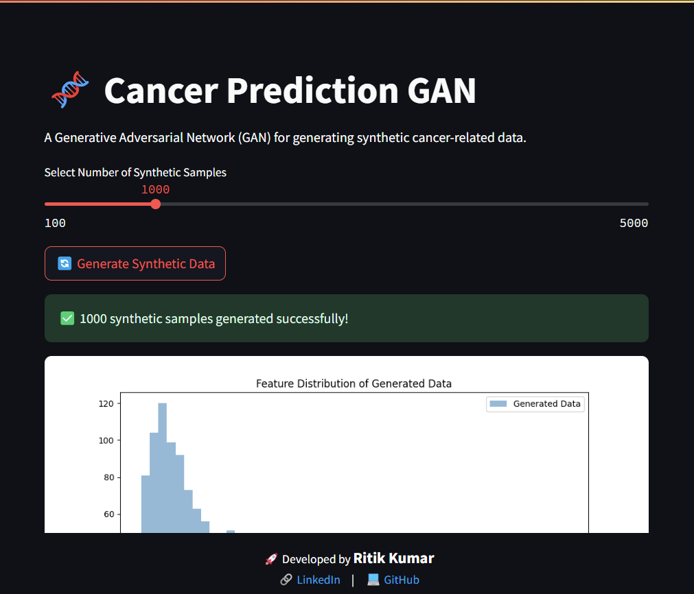

---

# 🧬 Cancer Prediction GAN

This project implements a **Generative Adversarial Network (GAN)** to generate synthetic cancer-related data. The model is trained on real medical data and produces synthetic samples for further analysis, research, and augmentation.

## 🚀 Features
- **Preprocessing:** Cleans and normalizes cancer dataset.
- **GAN Model:** Uses a **Generator** and **Discriminator** to learn and generate synthetic data.
- **Evaluation:** Compares generated data distribution with real data.
- **Deployment:** Integrated with **Flask & React** for web-based interaction.
- **Visualization:** Displays feature distributions and synthetic data statistics.

---

## 📂 Project Structure
```
CANCER PREDICTION GAN
│── data/
│   ├── Cancer_Data.csv             # Original dataset
│   ├── processed_data.pkl          # Scaled data for training
│
│── models/
│   ├── discriminator.pth           # Trained Discriminator model
│   ├── generator.pth               # Trained Generator model
│
│── results/
│   ├── feature_distribution.png    # Comparison of real vs generated data
│   ├── generated_samples.npy       # Saved synthetic data
│
│── scripts/
│   ├── preprocess.py               # Data preprocessing pipeline
│   ├── train.py                    # Training script for GAN
│   ├── generate.py                 # Generates synthetic data
│   ├── evaluate.py                 # Evaluates and visualizes results
│
│── Cancer-Prediction-GAN.py        # Main execution script
│── cancer_gan.py                   # Core GAN model definition
│── requirements.txt                 # Dependencies list
│── README.md                        # Project documentation
```

---

## 🔧 Installation

1. **Clone the Repository**
   ```bash
   git clone https://github.com/RitikRK96/Cancer-Prediction-GAN.git
   cd Cancer-Prediction-GAN
   ```

2. **Set Up a Virtual Environment**
   ```bash
   python -m venv .venv
   source .venv/bin/activate  # On Windows: .venv\Scripts\activate
   ```

3. **Install Dependencies**
   ```bash
   pip install -r requirements.txt
   ```

---

## 📊 Dataset
- The project uses a **Breast Cancer Dataset** (`Cancer_Data.csv`).
- Features are standardized using **StandardScaler**.
- The diagnosis column is encoded (`M=1`, `B=0`).

---

## 🏗️ How to Run

1. **Preprocess the Data**
   ```bash
   python scripts/preprocess.py
   ```

2. **Train the GAN Model**
   ```bash
   python scripts/train.py
   ```

3. **Generate Synthetic Data**
   ```bash
   python scripts/generate.py
   ```

4. **Evaluate and Visualize**
   ```bash
   python scripts/evaluate.py
   ```

5. **End-to-End Execution**
   ```bash
   python Cancer-Prediction-GAN.py
   ```

---

## 🌐 Web Deployment
The project is integrated with **Streamlit** for interactive use.

Run the web interface:
```bash
streamlit run app.py
```
---

## 🖥️ Model Architecture

### **Generator**
- Fully connected neural network.
- Uses **ReLU** activation for hidden layers.
- Outputs normalized synthetic data.

### **Discriminator**
- Binary classifier to differentiate real and fake data.
- Uses **Sigmoid** activation for output.

---

## 📈 Results
- **Feature Distributions:** Compares real and generated data.
- **Model Loss Graphs:** Tracks Generator and Discriminator loss.
- **Synthetic Data Visualization:** Generates feature samples.

## 📸 Screenshots

### 1️⃣ **Feature Distribution of Generated Data**
This graph shows how the synthetic data (blue) compares to real cancer data (orange).



---

---

## 📜 Acknowledgments
- Inspired by **GANs in Medical Research**.
- Dataset sourced from **UCI Breast Cancer Dataset**.

---

## 👨‍💻 Developed By
🚀 **Ritik Kumar**  
🔗 [LinkedIn](https://www.linkedin.com/in/ritik-kumar-34ab70218/)  
💻 [GitHub](https://github.com/RitikRK96)  

---
